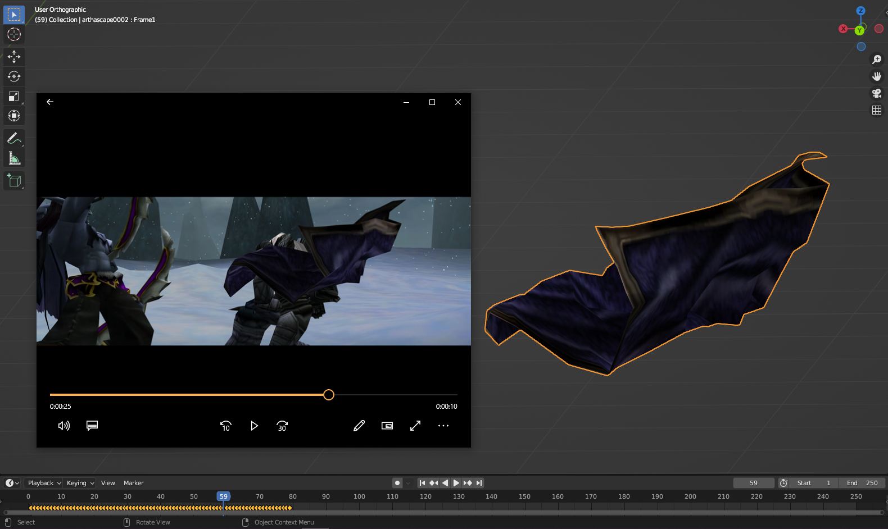
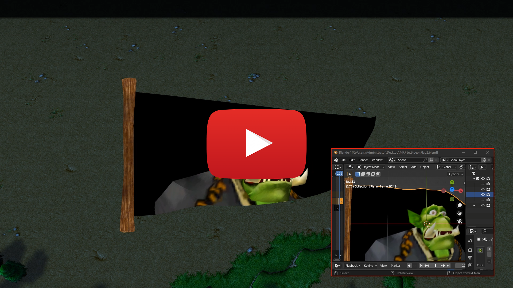

# Warcraft_MRF_Blender
Import and export Warcraft MRF files into Blender. The six original files can be found here.

These files were used by Blizzard to cloth simulation of Arthas' cloak in the Warcraft 3 TFT final battle cinematic model.

**Some details about this model format and the specification of binary data can be found in the [mrf_info.md](mrf_info.md) and [mrf_spec.md](mrf_spec.md) files respectively.
Examples of using custom .mrf files can be found in the [test folder](test).**

# Install
Made for Blender 3.6.2., tested also at 4.0.1  
- Copy the **io_warcraft_mrf** folder to the addons directory. For example **C:\Program Files\Blender Foundation\Blender 3.6\3.6\scripts\addons** .
- Enable addon in the Edit -> Preferences menu.
# Import
Use the operator **File -> Import -> Warcraft MORF (.mrf)**.  
Use the **Divider** property as a scaling factor (original size will be reduced). Enable smoothing if necessary. Morf animation will be imported as Shape Keys animation. Video is [here](https://youtu.be/AjGNrNym91g).
# Export

**Highly experimental!**  
Animation of mesh can be exported as .mrf.  
For exporting: 
1. **Create any mesh animation**. For example, this could be an animation of Shape Keys or a Cloth Simulation. It is very advisable to immediately **triangulate the mesh**.
2. If you are using cloth simulation, then **create an animation cache before exporting (Cache -> Bake).**
3. **Set the frame rate (Output Properties -> Frame Rate)**. This value will be used in the mrf file, 30 FPS is recommended.
4. **Place two markers on the timeline with the names “mrf”** (Hotkey M to add a marker, F2 to rename). The animation between and inclusive of these two markers will be exported. By default, if there are no markers, the animation between frames 0 and 23 inclusive will be exported.
5. **Set the path to the texture (Material Properties -> MRF Texture Scroll -> Path Property)**. By default, if there is no texture path, the "Textures/white" path will be used.
6. **Select one mesh object**, and use the **Export -> Export Warcraft MORF** operator. Change the scaling factor if necessary.
7. You can link the finished MRF file into the .mdx model through the MRF event object. *In the future, maybe mdx model generation will be integrated into this script*.

Video is [here](https://youtu.be/3nIO81QYOqE).