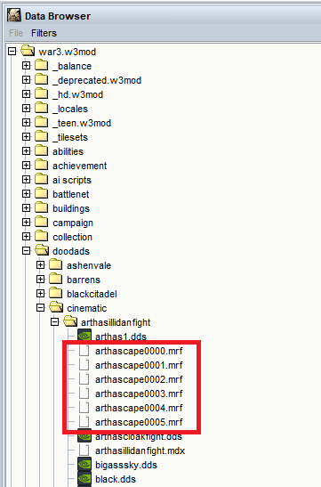

# Warcraft_MRF_Blender
Import and export Warcraft MRF files into Blender. The six original files can be found here.

**Some details about this model format and the specification of binary data can be found in the [mrf_info.md](mrf_info.md) file.
Examples of using custom .mrf files can be found in the [test folder](test).**

# Install
Made for Blender 3.6.2.  
- Copy the **io_warcraft_mrf** folder to the addons directory. For example **C:\Program Files\Blender Foundation\Blender 3.6\3.6\scripts\addons** .
- Enable addon in the Edit -> Preferences menu.
# Import
Use the operator **File -> Import -> Warcraft MORF (.mrf)**.  
Use the **Divider** property as a scaling factor (original size will be reduced). Enable smoothing if necessary. Morf animation will be imported as Shape Keys animation. Video is [here](https://youtu.be/AjGNrNym91g).
# Export
**Highly experimental!**  
Animation of mesh can be exported as .mrf.  
For exporting: 
1. **Create an animation**. For example, this could be an animation of Shape Keys or a Physics Simulation. It is very advisable to immediately **triangulate the mesh**.
2. If you are using physics simulation, then **create an animation cache before exporting (Cache -> Bake).**
3. **Set the frame rate (Output Properties -> Frame Rate)**. This value will be used in the mrf file, 30 FPS is recommended.
4. **Place two markers on the timeline with the names “mrf”** (Hotkey M to add a marker, F2 to rename). The animation between and inclusive of these two markers will be exported.
5. **Set the path to the texture (Material Properties -> MRF Texture Scroll -> Path Property)**.
6. **Select one mesh object**, and use the **Export -> Export Warcraft MORF** operator. Change the scaling factor if necessary.
7. You can link the finished MRF file into the .mdx model through the MRF event object.  

Video is [here](https://youtu.be/3nIO81QYOqE).