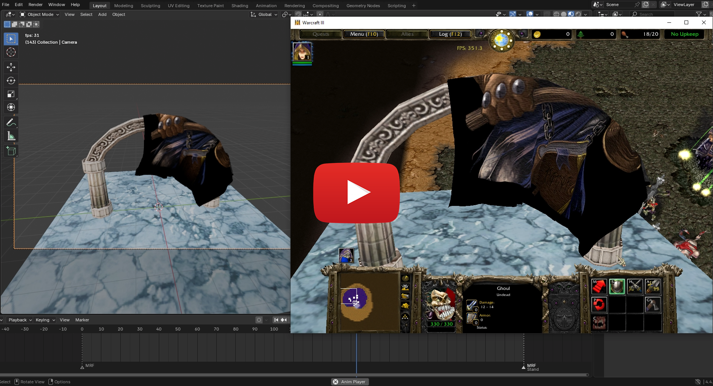

# MRF Stuff
The six original files could be found in the game archives at these paths:

```
doodads\cinematic\arthasillidanfight\arthascape0000.mrf
doodads\cinematic\arthasillidanfight\arthascape0001.mrf
doodads\cinematic\arthasillidanfight\arthascape0002.mrf
doodads\cinematic\arthasillidanfight\arthascape0003.mrf
doodads\cinematic\arthasillidanfight\arthascape0004.mrf
doodads\cinematic\arthasillidanfight\arthascape0005.mrf
```
> These files have been removed from the repository, use a legal copy of the game to get your own if you need them.

They were used by Blizzard to store the baked cloth simulation data of Arthas' cloak in the Warcraft 3 TFT final battle cinematic model.

[](https://youtu.be/AjGNrNym91g)

**Some details about this model format and the specification of binary data can be found in the [mrf_info.md](mrf_info.md) and [mrf_spec.md](mrf_spec.md) files respectively.
Examples of using custom .mrf files can be found in the [test folder](test).**

# Install
Last release made for Blender 4.4.3.
- Copy the `io_warcraft_mrf` folder to the `addons_core` directory. For example `C:\Program Files\Blender Foundation\Blender\4.4\scripts\addons_core\`.
- Enable add-on in the `Edit -> Preferences` menu.
# Import
Use the operator `File -> Import -> Warcraft MORF (.mrf)`.  
Use the `Divider` property as a scaling factor (original size will be reduced). Enable smoothing if necessary. Morf animation will be imported as Shape Keys animation. Video is [here](https://youtu.be/AjGNrNym91g).
# Export
[](https://youtu.be/OASOFjb8a4Q)

Animation of mesh can be exported as `.mrf`.  
For exporting: 
1. **Create any mesh (morph target) animation**. For example, this could be an animation of Shape Keys or a Cloth Simulation. The main condition is that the number of mesh vertices must remain the same throughout the animation.
2. If you are using cloth simulation, then **create an animation cache before exporting (`Cache -> Bake`).**
3. **Set the frame rate (`Output Properties -> Frame Rate`)**. This value will be used in the mrf file, `30` FPS is recommended.
4. **Place two markers on the timeline with the names `mrf`** (Hotkey `M` to add a marker, `F2` to rename). The animation between and inclusive of these two markers will be exported. Optionally, you can add a marker named `MRF_START` between these markers to start playing the animation in the game from it (but all frames will be written to the file). By default, if there are no markers, the animation between frames `0` and `23` inclusive will be exported.
5. **Set the path to the texture (`Material Properties -> MRF Texture -> Path Property`)**. By default, if there is no texture path, the "Textures/white" path will be used.
6. **Select one mesh object**, and use the `File -> Export -> Warcraft MORF (.mrf)` operator. Change the scaling factor and use [options](#export-options) if necessary.
7. You can link the finished MRF file into the `.mdx` model through the MRF event object. Use any convenient model editor for this or edit it in text form.

Video is [here](https://youtu.be/3nIO81QYOqE).

## Export Options:
- **Pack for import**. Make a copy and apply the path `doodads/cinematic/arthasillidanfight/arthascape` to it. Can export directly to the root of your map in folder mode.
- **Embed export signature**. Adds a 24-byte signature to the unused header space. Disable for clean exports.
- **Scale factor**. Scale the mesh to fit Warcraft world sizes.
- **Deduplicate mesh**. Removes duplicate vertices with same position, normal, and UV. Useful for optimizing size and animation data.
- **Playback Delay**. Set animation playback delay in seconds. This option will overwrite the offset from the `MRF_START` marker.
- **Compute Pivot/Radius**. Compute pivot point and bounds radius from mesh geometry. Not guaranteed to match Blizzard software behavior! 
- **Reverse Animation**. Export keyframes from end to start (reversed playback). 

<hr>

[](https://youtu.be/pQAQv5l21V4)
